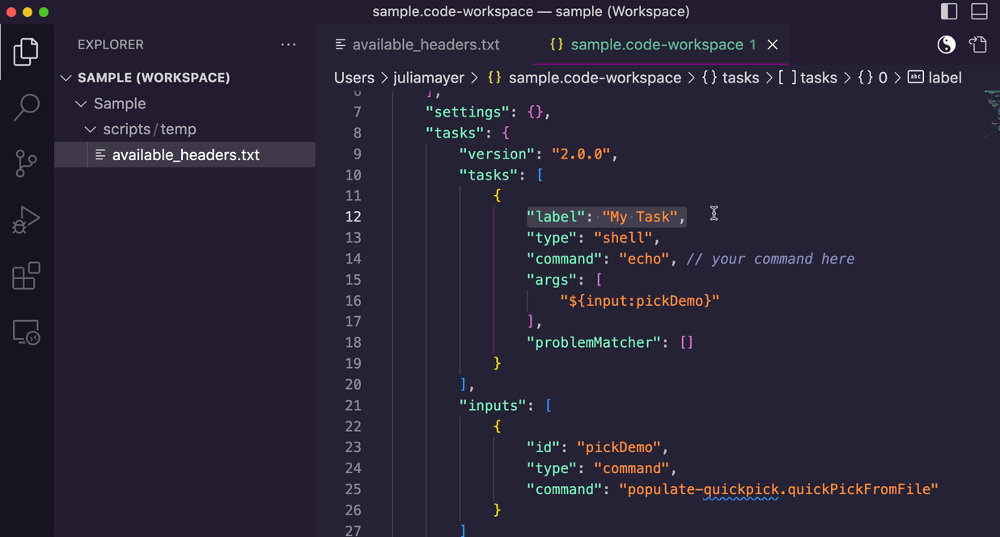

# quickPickFromFile
This extension generates a QuickPick. The options are provided in a file. It returns the selection for further use.


## Usage
Dynamically creates options for a QuickPick in custom VSC [tasks](https://code.visualstudio.com/docs/editor/tasks). 





For example in your `sample.code-workspace`:
```json
	"tasks": {
		"version": "2.0.0",
		"tasks": [
			{
				"label": "My Task",
				"type": "shell",
				"command": "echo", // your command here
				"args": [
					"${input:pickDemo}"
				],
				"problemMatcher": []
			}
		],
		"inputs": [
			{
				"id": "pickDemo",
				"type": "command",
				"command": "populate-quickpick.quickPickFromFile"
			}
		]
```

If you call the task `My Task`, a QuickPick window will appear. It lists the options provided in `myFile`. The selected option is then echoed.

This allows to easily pass an argument from within VSC to a python script and much more.

```json
"command": "python",
"args": [
    "script.py",
	"--arg",
    "${input:pickDemo}"
    ]
```


## `myFile` Details

- path to file
  - must be created as such `<workspacePath>/scripts/temp/available_headers.txt`
  - the extension adapts automatically to the workspace you are in

- format
  - every line is listed as one option in the QuickPick window
  - the file is split with the `\n` character

```
option 1
option 2
... 
```


## TODO
- [ ] add file path as option in user settings
- [ ] ensure cross-platform compatibility for line split
- [ ] make extension run not only for workspaces but also without a workspace
- [ ] allow a hierarchy of topics
- [ ] make nested QuickPicks available for different hierarchy topics like shown in the [QuickInput examples](https://github.com/microsoft/vscode-extension-samples/tree/main/quickinput-sample)


## Links
- What is a [QuickPick](https://code.visualstudio.com/api/ux-guidelines/quick-picks)?
- [QuickInput examples](https://github.com/microsoft/vscode-extension-samples/tree/main/quickinput-sample) from VSC
- Original idea of how to [populate a pickString dynamically](https://stackoverflow.com/a/64637337/19407854) within a task using an extension
